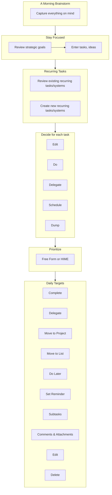

# Simpleology Simplified

## Overview
In the main [Simpleology](simpleology.md) document there is a flowchart that shows the workflow one progresses through when using Simpleology, it's a bit overwhelming, this document focuses on providing a simplified view which highlights the areas I'm particularly interested in.

## Simplified Flowchart
