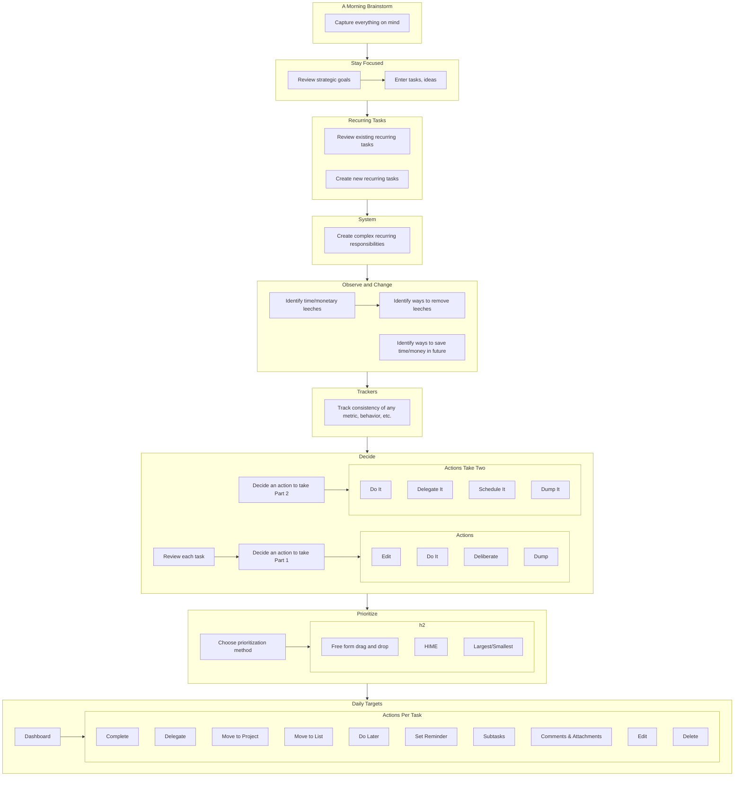

# Simpleology

Site: https://simpleology.com/

## Unique Features

Simpleology offers a workflow that pushes one through the process of capturing tasks, prioritizing them, deciding how to take action on them, and ensuring one keeps strategic priorities in mind.

The workflow is as follows:

### The Morning Brainstorm
- Capture all the things that are on your mind - this includes tasks, ideas, etc.

### Stay Focused
- In this step one reviews one's strategic goals divided into three categories: Short-Term, Medium-Term, and Long-Term.
- One can enter tasks and ideas here as the goals prompt them to arise.

### Recurring Tasks
- Allows one to create and review tasks that recur.

### System
- Similar to a recurring task but for more complex responsibilities.
- One creates a "system" which consists of multiple "tasks" which recur.
- Shows the systems plotted on the calendar.

### Observe and Change
- Allows one to identify time leeches, ways to remove leaches, time savers, and ways to save time in the future.

### Trackers
- Can be used to track how consistent one is with anything - for example, eating healthy or exercising.

### Decide
- Provides a list of tasks that have accumulated as one has worked through the previous steps, includes those that captured in the "Dream Catcher" (essentially, an inbox), daily targets that weren't completed, and reminders.
- One must then decide how to handle each task:
    - Edit
    - Do It
    - Deliberate - Allows one to postpone the task by adding it to a list and setting a reminder.
    - Dump - Deletes the task
- Somewhat duplicatively, one then has to select whether one is going to do it, delegate it, schedule it, or dump it.
    - The big one here is the delegate option.

### Prioritize
- One then chooses how one wants to approach the tasks for the day. One can "free form" drag and drop tasks into any order.
- My favorite method is HIME, which standards for High Impact, Minimal Effort. This allows one to rate how much of an impact the task will make and how much effort it will take. One then gets a "HIME" score which is the impact multiplied by the ease.
- One can also rank them by ranking which are the "biggest" and which are the "smallest" tasks and then deciding how to approach them (e.g., smallest to largest or largest to smallest).

### Daily Targets
- A dashboard of sorts one lands on after completing the workflow. One sees only the tasks one selected for the day. You can then complete or make changes to the tasks:
    - Complete
    - Delegate
    - Move to Project
    - Move to List
    - Do Later
    - Set Reminder
    - Subtasks
    - Comments & Attachments
    - Edit
    - Delete

### Other Notes
One can turn on/off most of the features of the workflow and there are a few items I didn't include: "Business Growth", "Financial Growth", and "Ben Franklin Habits".

### Flowchart

## Other Functionality

### Stuff I Want

There is a special list for "Stuff I Want" that is divided into three sections that focuses on:
    - Things about ourselves
    - Material things we could have
    - Things we could be doing

One can then assign each of these items to a Short, Mid, or Long-Term focus to keep this strategic goal at the forefront of one's mind.

### Backwards Planner

There is also a "Backwards Planner" which can be a helpful tool when you can't figure out where to start with achieving a goal. Instead of starting from the beginning one starts from the end, what is the step right before one accomplishes the goal? The step before that? And so on.

### Projects

This is essentially Kanban boards. Cards appear to be separate from tasks but can contain tasks.

### Dashboards

Allows one to create a dashboard that can include both internal cards (e.g. Daily Targets, Dream Catcher) as well as external cards (RSS, MySQL, Google Sheets, or text).

### Rituals

A ritual is something one needs to do on a repetitive basis (e.g. exercise) and the steps walks one through the ritual.

It can be used as a motivational tool, e.g., various reminders as to one really does want to get out of bed in the morning.

## Omnibox

Allows one to add tasks from the browser omnibox.

## Engines

Determines what should happen when specific keywords are used when adding a task - e.g., move to a specific list or log an observation.

